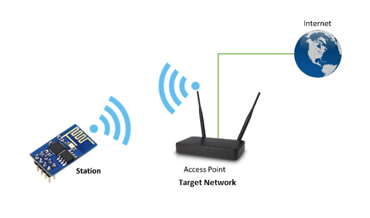

# Verde Pot Controller

VPC is an Arduino project created for bringing a flower pot into the IoT world using the NodeMCU devkit.


 ### Connecting to Internet by mobile phone
For connecting the VPC to Internet an Internet connected Wi-Fi network is needed. Throughout this document will call this Wi-Fi network **"target network"(TN)**.  

The Internet connection is done by using the *ESP8266* module in **Soft Access Point(SoftAP) mode** first and then switch to **Station mode**. Creating the SoftAP is needed because the SSID and password of the TN are not known upfront.

The ESP8266 first boots in SoftAP mode, so we can connect to it using the mobile phone and provide credentials to the TN.


By searching the Wi-Fi networks on your mobile you will find a network named something like: `Verde_xxxxxxxxxxx`. You will have to connect to it using the your pot password(you will be given this password).

Now, to be able to receive the credentials for the TN, a web sever will be created. It will be available at:

 `http://<SoftAP IP>:80/target-network`.

 The server will listen to this endpoint, so to send the credentials for the TN you will need to call:
```json
HTTP POST http://<SoftAP IP>:80/target-network
 {
   "ssid":"TP-LINK_BE92",
   "pass":"53342xxx"
 }
```
If the call is successful, you should see the following HTTP response:
`204 No Content`

**Switch to station mode(SM)**


After receiving the credentials, ESP8266 will switch to **Station mode** so it will be able to connect to the TN.  If the connection takes more than 20 sec, it will try to reconnect again.




For being able to know the status of the connection from the mobile phone, another endpoint is exposed:

`http://<SoftAP IP>:80/target-network/status`.

Successfully calling this endpoint with HTTP GET method will result in the following response:
```
{
  "resp" : "<connection_status>"
}
```  
where `<connection_status>` values can be:
```
 0  (WL_IDLE_STATUS)
 1  (WL_NO_SSID_AVAIL)
 2  (WL_SCAN_COMPLETED)
 3  (WL_CONNECTED)
 4  (WL_CONNECT_FAILED)
 5  (WL_CONNECTION_LOST)
 6  (WL_DISCONNECTED)
```
On the mobile phone, these responses must be handled accordingly: if the response has connection status is different than 3, this may represent the fact that the credentials must be sent again until the status endpoint will respond with `3 (WL_CONNECTED)`.


Once the credentials were sent and the connection is successful, the **SoftAP mode** is disabled.


 ### Websockets Connection

WS protocol was chosen because it offers a bidirectional, instant communication between client and server. To establish a WS connection, it is required for the client to send a handshake request to the server.


In this context, ESP8266 plays the client role because it needs to know the address of the server in order to do the handshake.

The WS Server is available over Internet at: `b5ec4d23.ngrok.io/verde/socket/pot/{id}`.

After the handshake, if the connection was successfully established, the client will send a ping message at 15 seconds interval. If not receiving 2 pongs from the server it will disconnect.

If disconnected, it will automatically try to connect again after 5 seconds.

### Communication

ESP8266 will communicate with it's mobile 'pair' trough the [VWSS](https://github.com/DIuliana/verde-websockets-server). Depending on what messages are received, the required actions are made and the according responses transmitted back.


#### 1. Watering system

The watering system is based upon a humidity sensor and a water pump. When the humidity gets under a certain level, the water pump will start.

**Messaging**

ESP8266 will listen to JSON messages like:

```json
{
    "target_humidity": 40
}
```


Dependencies:
1.  ESP8266WiFi Arduino library:

  * Source: https://github.com/esp8266/Arduino/tree/master/libraries/ESP8266WiFi
  * Docs: https://arduino-esp8266.readthedocs.io/en/latest/esp8266wifi/readme.html

2. ESP8266WebServer Arduino library:

    * Source: https://github.com/esp8266/Arduino/tree/master/libraries/ESP8266WebServer
    * Docs: https://lastminuteengineers.com/creating-esp8266-web-server-arduino-ide/
      https://github.com/jeremypoulter/SmartPlug/blob/master/src/web_ui.cpp#L111:L151

3. ArduinoJson Arduino library:
    * Source/Docs: https://arduinojson.org/

4. TaskScheduler
    * Source: https://github.com/arkhipenko/TaskScheduler/
    * Docs: https://github.com/arkhipenko/TaskScheduler/wiki/Creating-TaskScheduler---friendly-libraries
            https://github.com/arkhipenko/TaskScheduler/wiki/API-Documentation

5. Websockets
    * Source: https://github.com/Links2004/arduinoWebSockets
